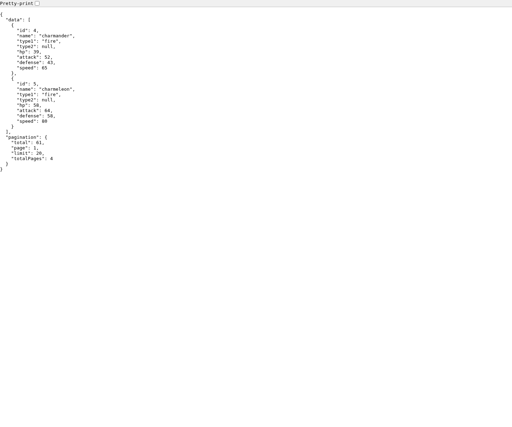
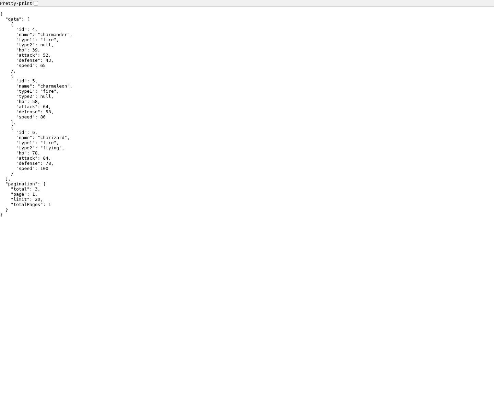
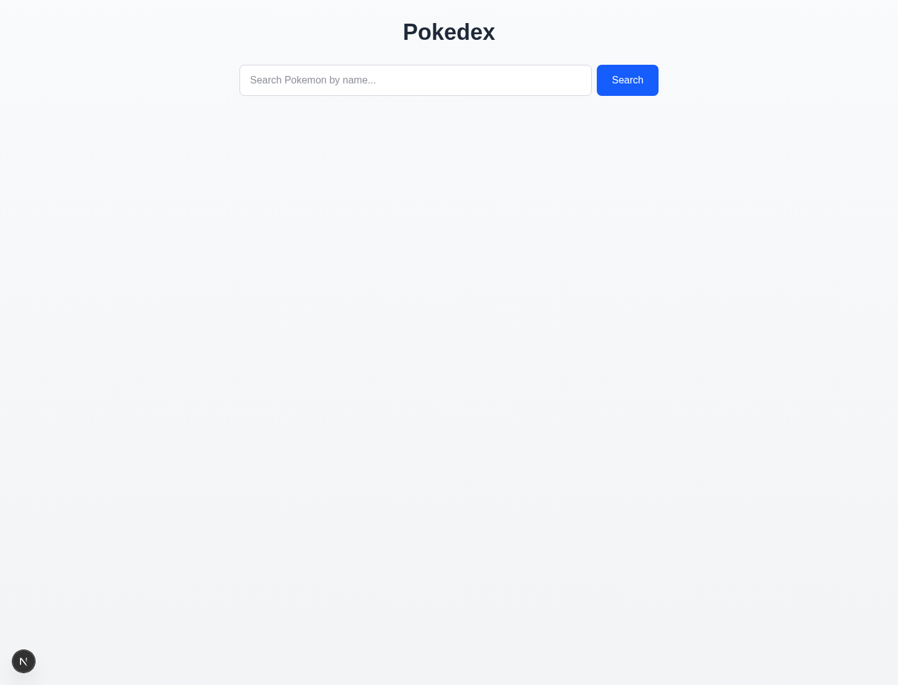
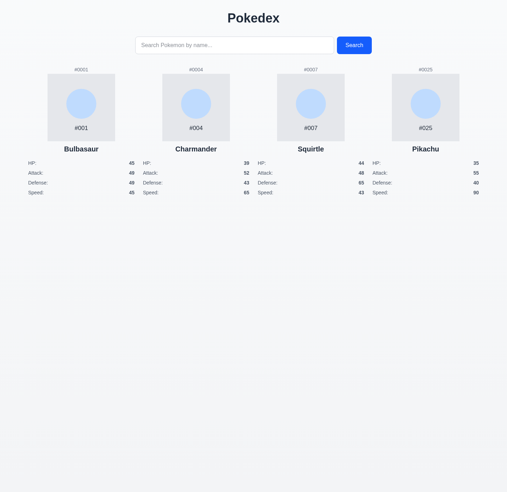
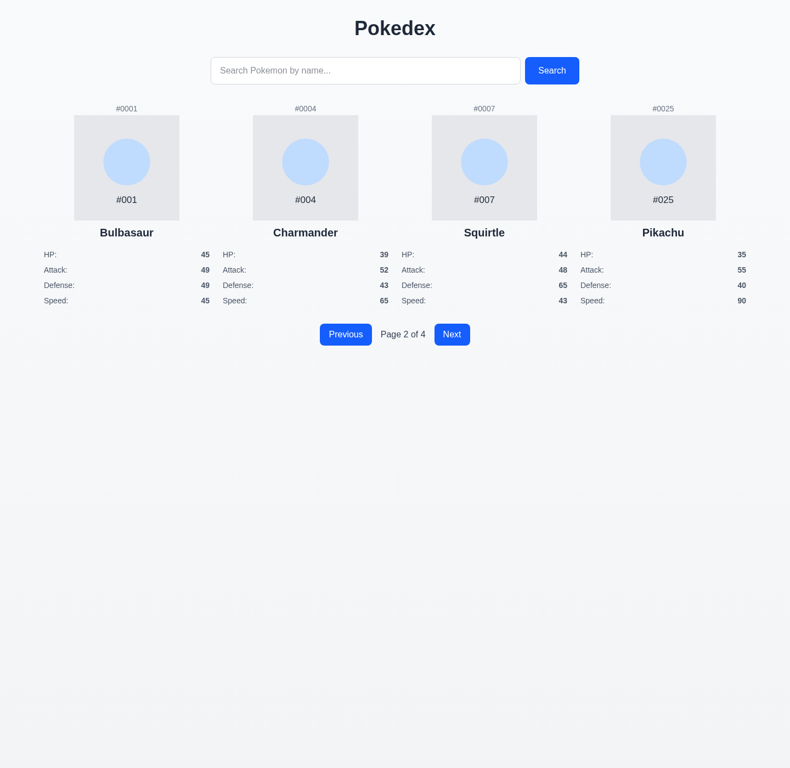
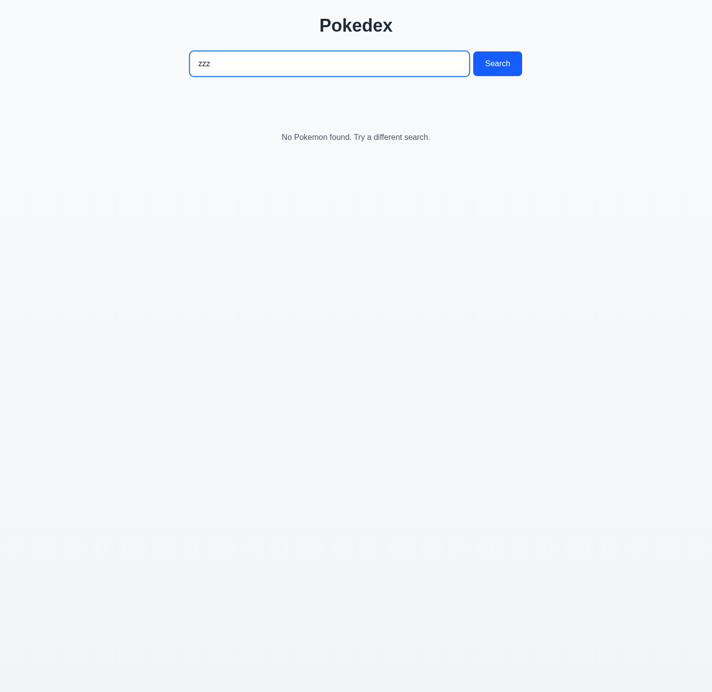
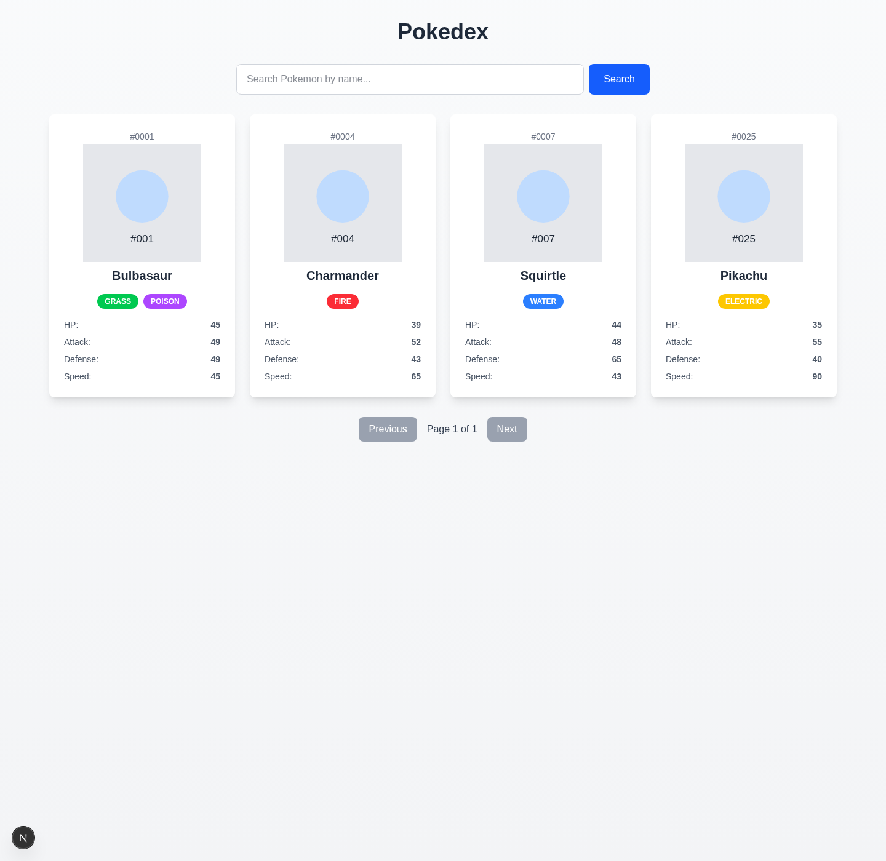
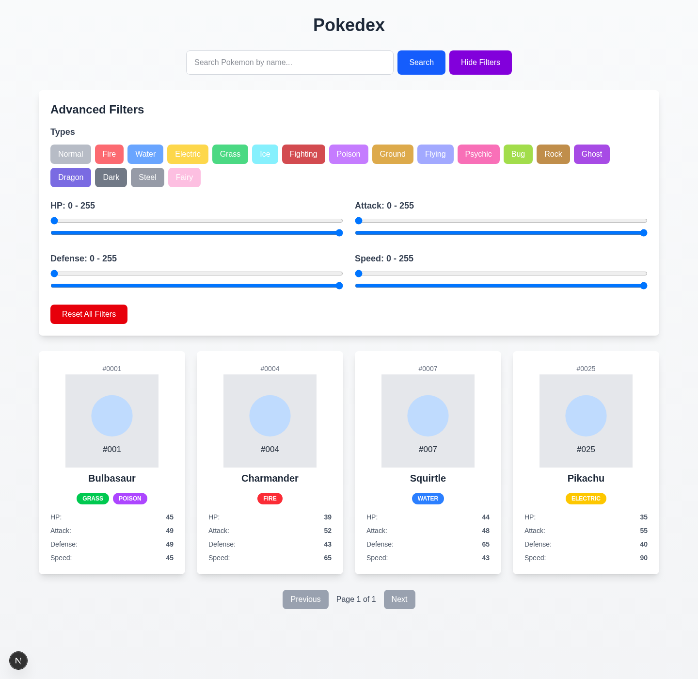

# Branch Visual Guide

This guide walks through the numbered teaching branches from `000` to `012` and pairs each branch with a representative screenshot.

## Capture Notes

- Stages `000`, `001`, and `007` were captured directly from the branch UI.
- Stages `002` through `006` were captured by opening the relevant API route in the browser and fulfilling the response with mocked JSON so the visual matches the intended behavior.
- Stages `008` through `012` were captured with mocked API responses because no local MySQL server was running during the screenshot pass.

## Stage 000

Fresh Next.js scaffold before any Pokedex-specific work.

## Stage 001

First API route: a placeholder JSON response at `/api/pokemon`.

## Stage 002

Database-backed list route with pagination shape added to the response.

## Stage 003

Type filtering added to the main Pokemon list API.

## Stage 004

Name search added to the list API.

## Stage 005

Stat-range filtering added to the API.

## Stage 006

Single-Pokemon endpoint added at `/api/pokemon/[id]`.

## Stage 007

The default homepage is replaced with the first custom Pokedex search UI.

## Stage 008

Search results are rendered as a card grid on the homepage.

## Stage 009

Pagination controls are added under the result grid.

## Stage 010

Loading and empty states are added; this screenshot shows the no-results state.

## Stage 011

Cards become clickable links that prepare the app for detail navigation.

## Stage 012

Advanced filters add type toggles and stat sliders to the UI.

## Suggested Use In Class

- Show `000` to establish the baseline.
- Use `001` through `006` to explain the API-first backend progression.
- Use `007` through `012` to explain the frontend build-out and why the earlier API design matters.
- After `012`, move to `main` for post-curriculum cleanup and deployment preparation.
